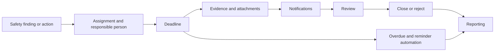
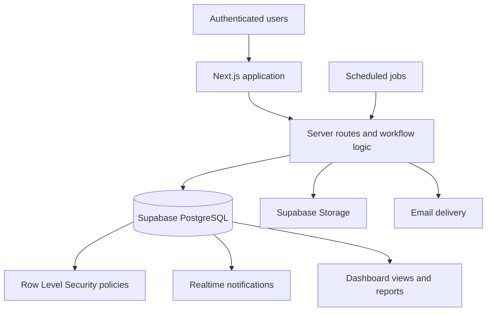

# ISG ATS

ISG ATS is an operational action tracking system built for occupational-safety specialists at a construction company.

**Status:** Operational business system with a private authenticated deployment.  
**Repository:** Public source; no public demo is advertised.

## Workflow

The system follows a real safety-action lifecycle rather than a generic task-board model:

Inspectors create and follow findings, responsible users act on assigned work, and administrators manage the broader operational view. The workflow retains action notes, evidence, status changes, deadlines, and notification state around each record.

## What I Built

- Role-aware workflows for administrators, inspectors, and responsible users
- Safety action creation, assignment, deadlines, severity, and status transitions
- Evidence upload and attachment handling through Supabase Storage
- Action history and review-oriented task detail views
- In-app notifications with Supabase Realtime updates
- Email notification delivery and delivery logging
- Scheduled reminder and overdue-processing routes
- Dashboard statistics and reporting/export utilities
- Administrative user, location, and category management

## Architecture

## Database and Access Model

The repository includes 15 ordered SQL migrations covering core enums, locations, task categories, profiles, tasks, evidence, attachments, action history, notifications, email logs, Row Level Security, Storage policies, Realtime configuration, reporting views, and later access/stability fixes.

RLS policies scope records by authenticated identity and role. Administrators can access the full operational view, inspectors work with findings they created, and responsible users work with their assignments. Storage and notification records follow the same authenticated workflow boundary.

## Engineering Highlights

- Workflow rules are represented in application and database layers rather than only in UI state.
- Scheduled reminder and overdue routes keep time-based follow-up explicit and auditable.
- File selection and upload utilities include Vitest coverage alongside the application test setup.
- Realtime notifications complement, rather than replace, persisted notification and email records.
- Production company and worker information is kept outside the public documentation.

## Technology

Next.js, React, TypeScript, Supabase Auth, PostgreSQL, Row Level Security, Supabase Storage, Supabase Realtime, Nodemailer, scheduled routes, Vitest, and schema-based form validation.

## Privacy and Deployment

The real deployment is authenticated and private; it is not a public SaaS demo. The repository documents the implementation without publishing real company records, worker data, production credentials, or deployment access details.

## Author

Built by **Göktürk Kahriman**, Full-stack & AI Systems Developer.
